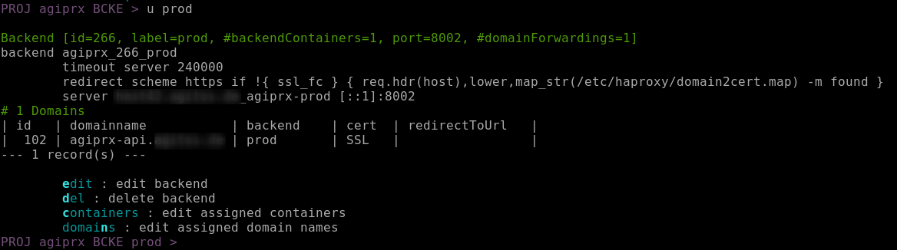

# AgiPrx Setup

## Precondition

The following deployment is based on [ansible](https://docs.ansible.com/ansible/latest/) with focus on Debian/Ubuntu.

Some basic/external packages will be required: 'bash', 'nano', 'ssh', 'mariadb-server', 'python-pymysql', 'python3-pymysql', 'openssl', 'certbot', 'unzip', 'cron'.

## Check encryption of secured config files

In production some config files should be secured/encrypted with passwords/private keys by `ansible-vault`, in this sample setup this would refer to:

* ansible/secured-vars.yml.tpl
* ansible/roles/agiprxapp/files/master.example.org/application.properties
* ansible/roles/agiprxapp/files/master.example.org/prx_rsa
* ansible/roles/agiprxapp/files/slave.example.org/application.properties
* ansible/roles/agiprxapp/files/slave.example.org/prx_rsa

Optionally set your own password first with e.g.

`ansible-vault encrypt ansible/secured-vars.yml`

Open these files in the next section via e.g.

`export EDITOR=nano; ansible-vault edit ansible/secured-vars.yml`

## Configure new AgiPrx proxy by ansible

1. clone this project; the last JAR build/release of agiprx is included (no need to build the project from source code)
   `git clone https://github.com/usrflo/agiprx-setup.git`
1. create your **ansible/hosts** inventory file from **ansible/hosts.tpl**
1. create your **ansible/secured-vars.yml** from **ansible/secured-vars.yml.tpl**
1. add your hostname(s) to inventory file **ansible/hosts** with basic configuration
1. create a directory ansible/roles/agiprxapp/files/**hostname** per host; use e.g. ansible/roles/agiprxapp/files/master.example.org as a template
1. add and modify **application.properties** inside the host directory, see comments inside the file; special hints:
     - assure a Letsencrypt/ACME account is available at /etc/letsencrypt/accounts/ (master instance only); if not available use `certbot register -n --agree-tos -m webmaster@example.org` to register a new account 
     - set Letsencrypt/ACME account number in property 'cert.certbotnewcertcommand'
1. add and modify **adminuser.sql** inside the host directory: set initial superadmin user / ssh public key
1. add and modify **agiprx_authorized_keys** inside the host directory: set initial superadmin ssh public key
1. edit **ansible/secured-vars.yml** and set the database password according to **application.properties**
1. generate a new key-pair namend 'prx_rsa[.pub]' with e.g.
   `ssh-keygen -q -N '' -f prx_rsa -C agiprx`
1. authorize the generated prx_rsa.pub in the target containers/virtual machines/servers environments in .ssh/authorized_keys
1. optional: encrypt application.properties by
   `ansible-vault encrypt application.properties`
1. optional: encrypt prx_rsa by
   `ansible-vault encrypt prx_rsa`
1. deploy by ansible with e.g.<br>
   `$ ansible-playbook -i hosts --limit="master.example.org" --ask-vault-pass -D playbook-agiprxsetup.yml`
1. mandatory: setup maintenance script **scripts/run-maintenance.sh**, use **scripts/run-maintenance.sh.sample** as a template
1. optional: setup AgiPrx REST-API
     1. configure first project named AgiPrx with AgiPrx-REST-API backend on ::1 with API port (default: 8002) and dummy container on ::1
     1. open API port in firewall
     1. after configuration the backend configuration summary looks like this:
     


# Optional Master-Slave Setup

* copy SSH public key from root@master to all root@slave instances to connect for AgiPrx updates:

```
master> ssh-copy-id -p2222 root@all-slaves`
```

* edit application.properties on master instance:

```
...
### BEGIN: master instance configuration ###
agiprx.masterinstance=true

# define slave instance IPs on distributed setup; a list of IPs is space separated, ip4 can be mixed with ip6
agiprx.slaveIpList=1.2.3.5 1.2.3.6

# path to sync script for slave synchronization; first and only argument is the slave server ip
agiprx.slaveSyncCommand=/opt/agiprx/scripts/sync-to-slave.sh

# accepted IPs in domain name validation; a list of IPs is space separated, ip4 can be mixed with ip6
# those IPs directly or indirectly need to refer/forward to the configured master/slave proxies;
domain.trustedIps=1.2.3.4 1.2.3.5 1.2.3.6 ::2

### END: master instance configuration ###
...
```

* edit application.properties on slave instance(s):

```
...
### BEGIN: slave instance configuration ###
agiprx.masterinstance=false

# master IP v4v6
agiprx.masterIp=1.2.3.4

### END: slave instance configuration ###
...
```

Restart 'agiprx' on all instances.


# Manual Failover: Configure a new Master in Master-Slave Setup

A master change is very similar to the initial setup:

* copy SSH public key from root@new-master to all root@slave instances to connect for AgiPrx updates:

```
new-master> ssh-copy-id -p2222 root@all-slaves
```

* edit application.properties on new master instance:

```
...
### BEGIN: master instance configuration ###
agiprx.masterinstance=true

# define slave instance IPs on distributed setup; a list of IPs is space separated, ip4 can be mixed with ip6
agiprx.slaveIpList=1.2.3.4 1.2.3.6

# path to sync script for slave synchronization; first and only argument is the slave server ip
agiprx.slaveSyncCommand=/opt/agiprx/scripts/sync-to-slave.sh

# accepted IPs in domain name validation; a list of IPs is space separated, ip4 can be mixed with ip6
# those IPs directly or indirectly need to refer/forward to the configured master/slave proxies;
domain.trustedIps=1.2.3.4 1.2.3.5 1.2.3.6 ::2

### END: master instance configuration ###
...
```

* edit application.properties on old master and slave instance(s):

```
...
### BEGIN: slave instance configuration ###
agiprx.masterinstance=false

# master IP v4v6
agiprx.masterIp=1.2.3.5

### END: slave instance configuration ###
...
```

* restart 'agiprx' on all instances; the new master-ip is written to haproxy-letsencrypt-configs on all slave servers

* to register itself as new haproxy-letsencrypt master instance run AgiPrx command 'genhaprx' on the new master instance
